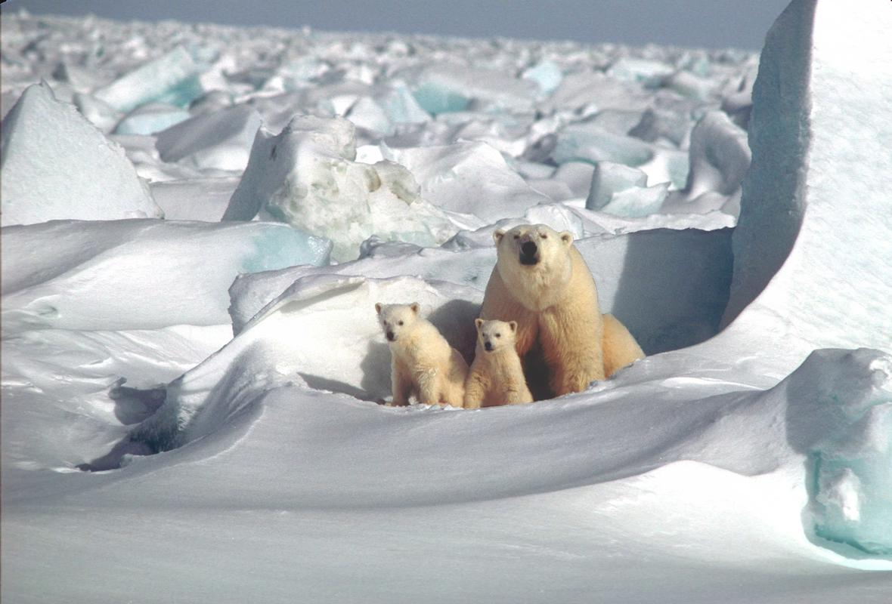
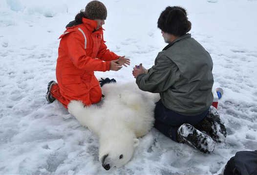
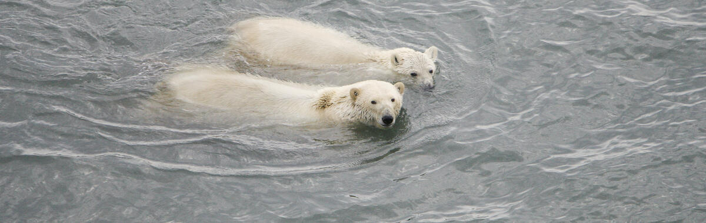
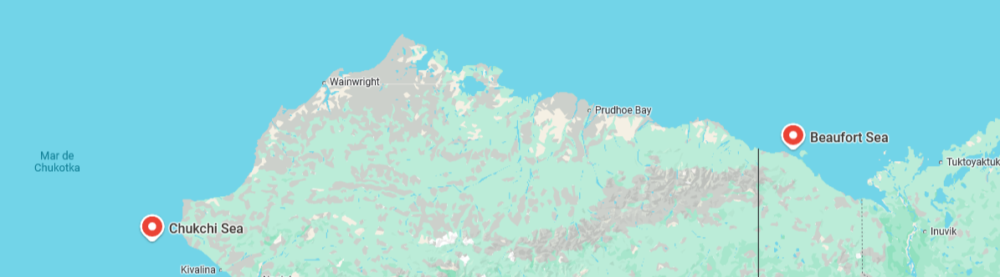
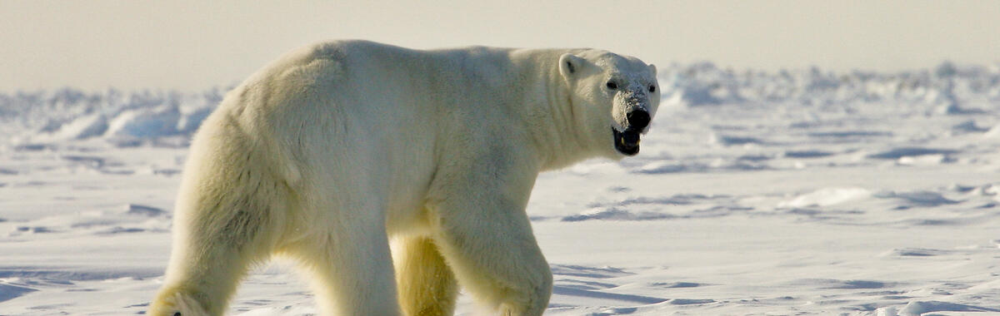
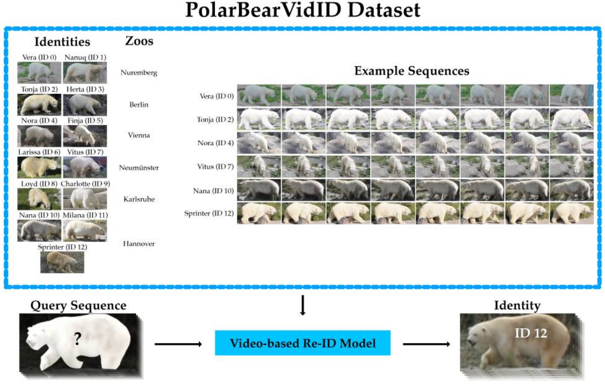

# Análisis multicomponente de comportamiento y detección de osos polares

## 1. La clásica: **Movimientos de osos polares (tracking de localización)**

### 1.1 Datos

``Dataset``: [Polar Bear CTCRW Movement Data – USGS](https://alaska.usgs.gov/data/polarBear/polarBear_CTCRWlocations_chukchiBeaufort_1985-2017/polarBear_CTCRWlocations_chukchiBeaufort_1985-2017.zip)  
``Size``: (338413, 6)

El conjunto de datos se compone de una tabla que contiene estimaciones de la ubicación de hembras adultas de oso polar durante el período comprendido entre julio y noviembre de los años 1985 a 2017. Este conjunto de datos se emplea para cuantificar los cambios en el uso del suelo durante el verano a lo largo del tiempo. 

Las ubicaciones se estimaron mediante un modelo de Paseo Aleatorio Continuo Correlacionado en el Tiempo (CTCRW, por sus siglas en inglés), ajustado al seguimiento por satélite de osos polares hembra adultos con radio-collar.  
 _George Durner, investigador polar del Servicio Geológico de EE.UU._

Todos los osos incluidos en este conjunto de datos fueron capturados e instrumentados en los mares de Beaufort o Chukchi.

El conjunto de datos contiene las siguientes características:

+ ``UniqueAnimalID``: Identificador único asignado a cada oso del conjunto de datos.

+ ``mu_lat``: Latitud estimada derivada por el modelo CTCRW para la marca de tiempo dada (_timestamp_).

+ ``mu_long``: Longitud estimada derivada del modelo CTCRW para la marca de tiempo dada (_timestamp_)     .

+ ``se_mu_x``: Error estándar de la localización media estimada (mu_lat) por el modelo CTCRW basado en el error estimado para las clases de localización Argos y las localizaciones GPS, y las diferencias de tiempo transcurrido entre los datos de localización de seguimiento empírico secuencial.

+ ``se_mu_y``: Error estándar de la ubicación media estimada (mu_lon) por el modelo CTCRW basado en el error estimado para las clases de ubicación Argos y las ubicaciones GPS, y las diferencias de tiempo transcurrido entre los datos de ubicación de seguimiento empírico secuencial.

### 1.2 Work approach

| Objetivo                                  | Tipo                  | Target                | Modelo                     |
|-------------------------------------------|-----------------------|-----------------------|-------------------------------------|
| ¿Qué distancia media recorre según sexo o edad? | Regresión             | _distance_per_day_      | Linear Regression, Ridge            |
| ¿Clasificar patrones de movimiento (activo, estacionario)? | Clasificación         | _movement_pattern_ | Logistic Regression, XGBoost        |
| ¿Segmentar osos por estilo de movimiento? | Clustering (no supervisado) | —                     | KMeans, HDBSCAN, PCA                |
| ¿Detectar anomalías en trayectorias?      | Anomaly detection     | —                     | Isolation Forest, OneClassSVM       |
| ¿Ubicación futura?      | Regresión     | —                     | Linear       |

Para ello se necesitaran generar variables derivadas como:
+ Velocidad, acceleración, cambio de dirección.
+ Distancia diaria, hábitat por zona (cruzado con mapas/coordenadas)

  

## 2. Visio: **Detección/segmentación de osos en entornos reales**

``Dataset imgs``: 
[PolarBearVidID](https://zenodo.org/records/7564529)  
``Size``: 138.363  
``Fuente``: https://pmc.ncbi.nlm.nih.gov/articles/PMC10000026/#sec2-animals-13-00801 

### Work approach
| Objetivo         |             Tipo             | Modelo            |
|---------------|-------------------------------|------------------|
| ¿Hay un oso en la imagen? | Clasificación   | CNN básica / ResNet |
| Localizar osos en imágenes | Detección      | YOLOv5/YOLOv8      | 
| Extraer silueta del oso    | Segmentación   | U-Net / DeepLabV3  |
| Seguimiento a través de frames* | Tracking   | Deep SORT         |

### Referencias:

* PolarBears- Polar Bear Continuous Time-Correlated Random Walk (CTCRW) Location Data Derived from Satellite Location Data, Chukchi and Beaufort Seas, July-November 1985-2017 (https://alaska.usgs.gov/products/data.php?dataid=525)

* [A Journey Through the Arctic: Using Machine Learning to cluster Female Polar Bears Based on Movement Patterns](https://medium.com/@viritaromero/a-journey-through-the-arctic-using-machine-learning-to-cluster-female-polar-bears-based-on-8a2870c5e53b)

### Tintero:

* Kaggle: ¿https://www.kaggle.com/datasets/mustafaemregk/polar-bears-features-dataset?
*https://www.kaggle.com/datasets/rustamakhmadullin1/bears-yolo-v8